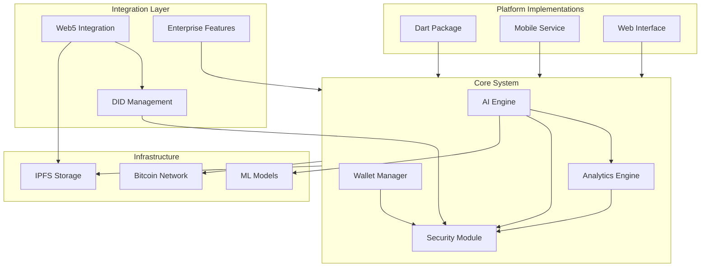
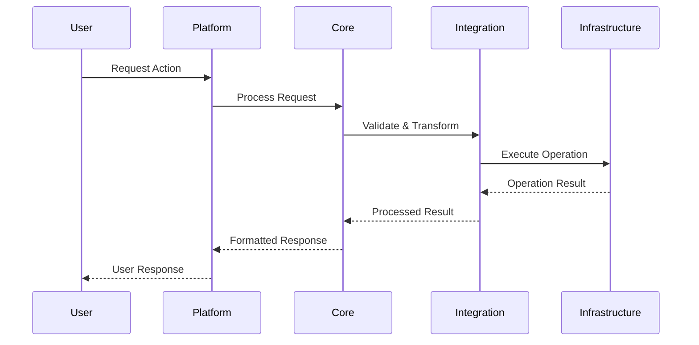
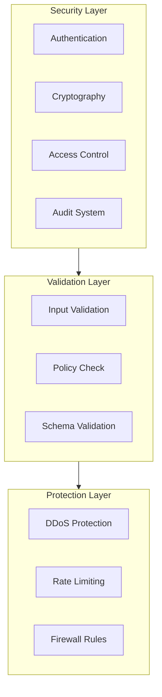
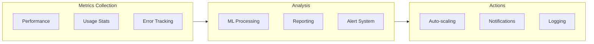

# dash33 System Architecture Map

## System Overview



## Component Details

### Core System
1. **AI Engine**
   - Model Management
   - Decision Making
   - Pattern Recognition
   - Performance Optimization

2. **Wallet Manager**
   - Key Management
   - Transaction Processing
   - Multi-signature Support
   - Hardware Integration

3. **Security Module**
   - Access Control
   - Encryption
   - Audit Logging
   - Policy Enforcement

4. **Analytics Engine**
   - Data Processing
   - Real-time Analysis
   - Reporting
   - Metrics Collection

### Platform Implementations
1. **Dart Package**
   ```mermaid
   graph LR
       DartCore[Core Package]
       UI[UI Components]
       State[State Management]
       Platform[Platform Services]

       DartCore --> UI
       DartCore --> State
       State --> UI
       Platform --> State
   ```

2. **Mobile Service**
   ```mermaid
   graph LR
       Service[Mobile Service]
       Auth[Authentication]
       Storage[Local Storage]
       Push[Push Notifications]

       Service --> Auth
       Service --> Storage
       Service --> Push
   ```

3. **Web Interface**
   ```mermaid
   graph LR
       WebApp[Web Application]
       API[API Layer]
       Cache[Cache Layer]
       UI[UI Components]

       WebApp --> API
       API --> Cache
       WebApp --> UI
   ```

### Integration Layer
1. **Web5 Integration**
   ```mermaid
   graph LR
       Web5Core[Web5 Core]
       DID[DID Manager]
       Data[Data Manager]
       Protocol[Protocol Handler]

       Web5Core --> DID
       Web5Core --> Data
       Web5Core --> Protocol
   ```

2. **Enterprise Features**
   ```mermaid
   graph LR
       EntCore[Enterprise Core]
       Auth[Authentication]
       Admin[Administration]
       Audit[Audit System]

       EntCore --> Auth
       EntCore --> Admin
       EntCore --> Audit
   ```

### Infrastructure
1. **Bitcoin Network**
   ```mermaid
   graph LR
       Node[Bitcoin Node]
       RPC[RPC Interface]
       Network[Network Layer]
       Mempool[Mempool Monitor]

       Node --> RPC
       Node --> Network
       Node --> Mempool
   ```

2. **IPFS Storage**
   ```mermaid
   graph LR
       IPFS[IPFS Node]
       Pin[Pin Service]
       Gateway[Gateway]
       Cache[Cache Layer]

       IPFS --> Pin
       IPFS --> Gateway
       Gateway --> Cache
   ```

## Data Flow



## Security Architecture



## Monitoring and Analytics


